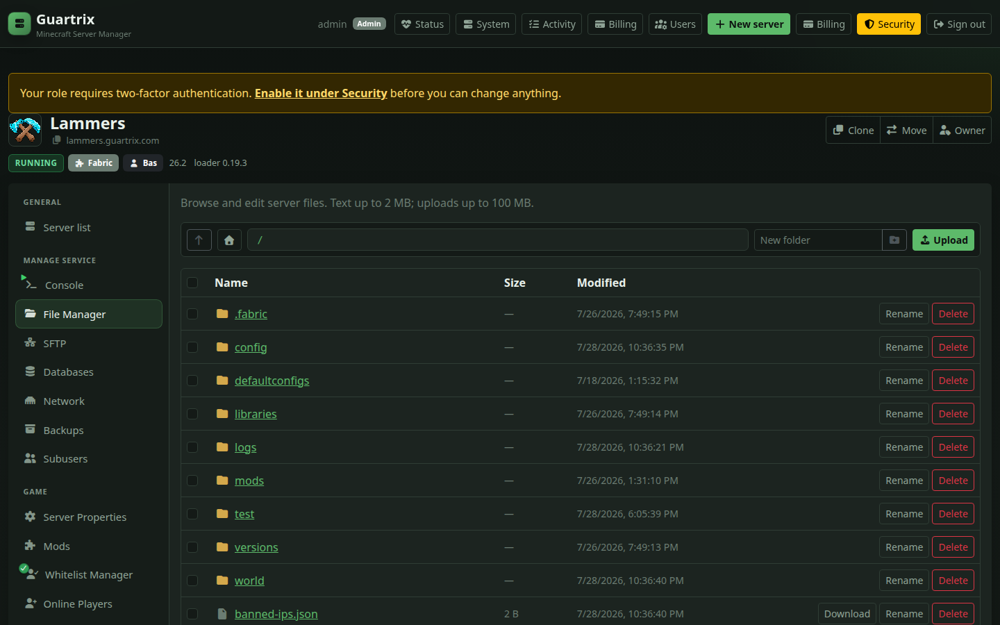

# Guartrix

**Self-hosted Minecraft hosting panel** — provision and operate game servers as Docker containers across one or more nodes.

> **AI-generated project disclaimer**
>
> This project was created as an experiment to see how far a product can be built with **100% AI using Cursor AI**. The full codebase was generated with AI assistance, so mistakes can exist. Expect rough edges, bugs, broken behavior, and possible security vulnerabilities or exploits. Review everything carefully before using this project in production or exposing it to the public internet.

| | |
|---|---|
| **Product** | [guartrix.com](https://guartrix.com) |
| **Public wiki** | `/wiki` on the panel web app |
| **Source** | [github.com/TomThermo/guartrix](https://github.com/TomThermo/guartrix) |
| **Documentation** | [Wiki](docs/wiki/README.md) · [Panel guide](docs/wiki/panel-guide.md) · [Improvement map](docs/roadmap.md) · [Changelog](CHANGELOG.md) |

---

## Overview

Guartrix is a panel and daemon stack for commercial or private Minecraft hosting:

- **Panel** — web UI and API for users, servers, billing hooks, and administration  
- **Daemon** — per-machine agent that runs Docker game containers, SFTP, and node MySQL  
- **Multi-node** — local and remote nodes; move servers between hosts from the admin UI  

Supported server types include **Java Edition** (Vanilla, Paper, Purpur, Fabric, Quilt, Forge, NeoForge) and **Bedrock Edition** (official Mojang BDS stable/preview, PocketMine-MP, Nukkit). Paper/Purpur can also expose **Geyser** so Bedrock clients join a Java server without a separate Bedrock runtime.

### Tech stack

| Layer | Technologies |
|-------|----------------|
| **Runtime** | Node.js **22+**, TypeScript |
| **Web UI** | React 19, Vite 6, React Router, Bootstrap 5 / React-Bootstrap |
| **API** | Fastify 5, Prisma → **MySQL** (panel DB) |
| **Daemon / nodes** | Fastify agent, Docker Engine (game containers), SFTP (`ssh2`), node-local MySQL for game DBs |
| **Optional** | Redis (sessions / rate limits / HA), SMTP, Mollie, Sentry, Prometheus metrics |
| **Prod serve** | `prod-web.mjs` serves `apps/web/dist` and proxies `/api` + `/ws` to the API |

Install targets and OS matrix: [Requirements](#requirements). Monorepo layout: [Architecture](#architecture).

---

## Screenshots

| Dashboard | Console | Plugins |
|-----------|---------|---------|
|  |  |  |

| SFTP | Files | Nodes |
|------|-------|-------|
|  |  |  |

Full UI tour: [Panel guide](docs/wiki/panel-guide.md).

---

## Capabilities

**Game servers** — create, import, clone, reinstall; change type/version; world reset and upload; live console and power controls; join card (copy/QR); seed map + optional BlueMap. **Java** and **native Bedrock** server families (BDS, PocketMine-MP, Nukkit) with UDP-primary networking for Bedrock.

**Resources** — RAM, CPU, and disk limits; live Docker stats; optional schedules (backup → restart → commands); crash auto-restart; owner alerts and Discord status webhooks.

**Files & access** — IDE-style file manager (folder tree, Monaco editor tabs, drag-and-drop upload); SFTP on port 2022 (`{username}.{serverId}`); subusers with invite links and scoped permissions.

**Content** — Modrinth plugins/mods and modpacks; recommended plugin stacks; optional CurseForge; one-click Geyser; Velocity/Bungee **backend** helpers (does not host the proxy); BlueMap / world map; admin Mineflayer bots.

**Data** — backups (manual and scheduled); per-server MySQL on the node (may share Docker MySQL with the panel on full installs).

**Platform** — registration with email verification; quotas (new accounts start at zero); optional TOTP; activity log and alerts; Client API keys; Mollie billing and Application API; license validation via `license.guartrix.com` (unlicensed free tier: 1 node, 1 server, 10 GB disk); i18n EN/NL; Redis HA for multi-API; Admin → Settings for mail/alerts/quotas; Admin → Status health board.

---

## Requirements

The installer targets **apt-based** Linux (**Docker**, **Node.js 22**, panel **MySQL**; optional Redis).

| Distribution | Status |
|--------------|--------|
| **Ubuntu 24.04 LTS** | Recommended |
| Ubuntu 22.04 LTS | Supported |
| Debian 12 | Compatible in practice; not the primary test target |
| Other (RHEL, Fedora, Arch, …) | Not supported by the installer |

Use a clean VPS with a public IPv4 address (x86_64).

---

## Installation

Pick Ubuntu, install basics, **download** the installer, then run it.

### 1. OS

**Ubuntu 24.04 LTS** (recommended) or **22.04 LTS**, fresh VPS, public IPv4.

### 2. Download the installer

```bash
curl -Lo /tmp/guartrix-install.sh \
  https://raw.githubusercontent.com/TomThermo/guartrix/main/scripts/install-panel.sh
```

### 3. Run it

```bash
sudo bash /tmp/guartrix-install.sh
```

The wizard configures role (full panel / panel-only / daemon-only), HTTP or HTTPS, MySQL, optional Redis, admin password, and license key.

**Automation** (flags, no full wizard):

```bash
sudo bash /tmp/guartrix-install.sh --full --http --ip YOUR.PUBLIC.IP
sudo bash /tmp/guartrix-install.sh --panel-only --http --ip YOUR.PUBLIC.IP
sudo bash /tmp/guartrix-install.sh --daemon-only \
  --token … --node-id … --ip NODE_IP --panel https://YOUR_PANEL
```

Guides: [Install the panel](docs/wiki/install-panel.md) · [Install nodes](docs/wiki/install-nodes.md)

### From a source checkout

```bash
cp .env.example .env   # configure secrets, PUBLIC_*, DATABASE_URL, LICENSE_*
npm install
npm run db:generate && bash scripts/db-migrate.sh
npm run build && bash scripts/start.sh
```

Environment reference: [env-reference.md](docs/wiki/env-reference.md)

---

## Architecture

```
Client ──HTTPS──► Web (:80 / :443) ──/api · /ws──► API (:3001, localhost)
                     │
                     └── static UI
API ──HTTP + WebSocket──► Daemon(s) (:8081) ──► Docker · SFTP (:2022) · MySQL
```

| Component | Responsibility |
|-----------|----------------|
| `apps/web` | React + Vite control panel |
| `apps/api` | Fastify API, sessions, Prisma (MySQL) |
| `apps/daemon` | Node agent HTTP API |
| `packages/node-agent` | Docker, files, SFTP, metrics, MySQL helper |
| `packages/shared` | Shared types, permissions, license verification |

Further reading: [Architecture](docs/wiki/architecture.md) · [Scaling](docs/wiki/scaling.md) · [Licensing](docs/wiki/licensing.md)

---

## Operations

```bash
npm run build          # compile (use build:release for minified shipping builds)
bash scripts/start.sh  # stop previous processes, health-check, start watchdog
```

| Port | Binding | Purpose |
|------|---------|---------|
| 80 / 443 | Public | Web UI (HTTP→HTTPS when TLS is enabled) |
| 3001 | Localhost | API (proxied by the web process) |
| 8081 | Localhost / node | Daemon |
| 2022 | Public (per node) | SFTP |
| 25565+ | Public | Game traffic |

Commercial packages: [Release builds](docs/wiki/release-builds.md) · day-to-day ops: [Operations](docs/wiki/operations.md) · [Security](docs/wiki/security.md)

### Accounts

- Bootstrap admin from `ADMIN_PASSWORD` when no users exist  
- Self-registration requires email verification  
- New operators receive **zero** server / RAM / database quota until an admin assigns limits  
- Without SMTP, outbound mail is written to `data/mail-outbox/`  

Details: [Accounts & quotas](docs/wiki/accounts-and-quotas.md)

### HTTP API

Automate the panel without a browser:

| Audience | Key | Docs |
|----------|-----|------|
| Server owners / subusers | `gt_` Client API | [Client API](docs/wiki/client-api.md) |
| Billing / provisioning integrations | `gta_` Application API | [Application API](docs/wiki/application-api.md) |
| All types + quick start | — | [API overview](docs/wiki/api-overview.md) |

```bash
# Permission catalog (no auth)
curl -sS https://guartrix.com/api/account/api-reference | jq '.clientApi.presets'

# Your servers
curl -sS -H "Authorization: Bearer gt_YOUR_KEY" https://guartrix.com/api/servers
```

OpenAPI: [docs/openapi.yaml](docs/openapi.yaml) · Create keys under **Account → Security**.

### SFTP

| Field | Value |
|-------|--------|
| Username | `{panelUsername}.{serverId}` |
| Password | Panel account password |
| Port | **2022** |
| Protocol | SFTP (not FTP) |

See [SFTP](docs/wiki/sftp.md).

---

## Development

```bash
npm run dev:api      # API on :3001
npm run dev:web      # UI on :5173 (proxies /api)
npm run dev:daemon   # optional local daemon
```

Guide: [Development](docs/wiki/development.md)

---

## Documentation

| Topic | Document |
|-------|----------|
| Wiki index | [docs/wiki/README.md](docs/wiki/README.md) |
| UI tour | [panel-guide.md](docs/wiki/panel-guide.md) |
| Install panel / nodes | [install-panel.md](docs/wiki/install-panel.md) · [install-nodes.md](docs/wiki/install-nodes.md) |
| Architecture & scaling | [architecture.md](docs/wiki/architecture.md) · [scaling.md](docs/wiki/scaling.md) |
| Feature references | [server-management.md](docs/wiki/server-management.md) · [databases.md](docs/wiki/databases.md) · [bots.md](docs/wiki/bots.md) · [files-and-backups.md](docs/wiki/files-and-backups.md) · [networking-and-allocations.md](docs/wiki/networking-and-allocations.md) · [mods-plugins-and-modpacks.md](docs/wiki/mods-plugins-and-modpacks.md) · [statusline.md](docs/wiki/statusline.md) |
| Internal references | [api-surface-map.md](docs/wiki/api-surface-map.md) · [daemon-api.md](docs/wiki/daemon-api.md) · [node-agent-internals.md](docs/wiki/node-agent-internals.md) · [shared-contracts.md](docs/wiki/shared-contracts.md) |
| Environment | [env-reference.md](docs/wiki/env-reference.md) |
| **APIs** | Panel **`/api-docs`** · **[api-overview.md](docs/wiki/api-overview.md)** · **[api-explorer](docs/wiki/api-explorer.md)** (Try it) · **[api-examples.md](docs/wiki/api-examples.md)** · [client-api.md](docs/wiki/client-api.md) · [application-api.md](docs/wiki/application-api.md) · [OpenAPI](docs/openapi.yaml) |
| Licensing & releases | [licensing.md](docs/wiki/licensing.md) · [release-builds.md](docs/wiki/release-builds.md) |
| Security & ops | [security.md](docs/wiki/security.md) · [operations.md](docs/wiki/operations.md) |
| Contributing | [CONTRIBUTING.md](CONTRIBUTING.md) |
| Improvement map | [docs/roadmap.md](docs/roadmap.md) — product shipped; customer go-live in install docs |

---

## License

Licensed under the MIT License. See [`LICENSE`](LICENSE).
