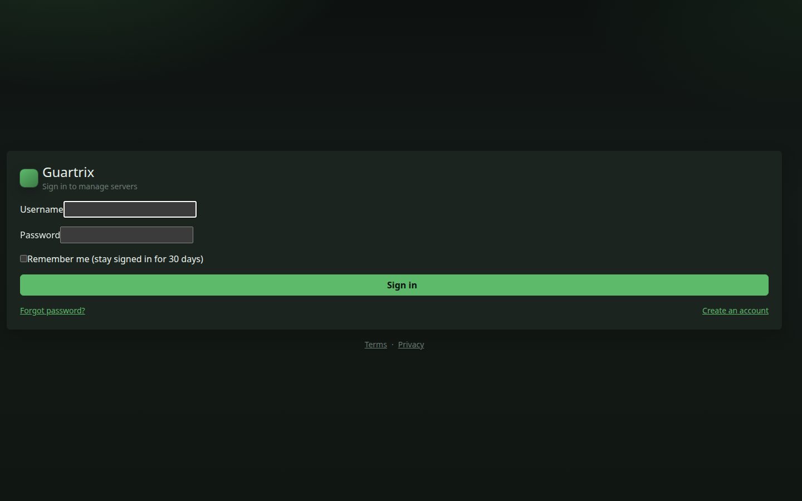
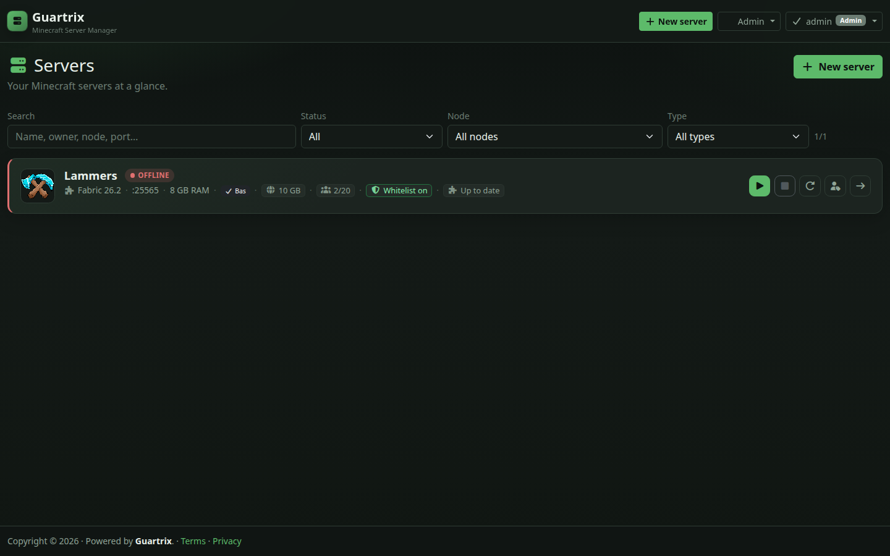
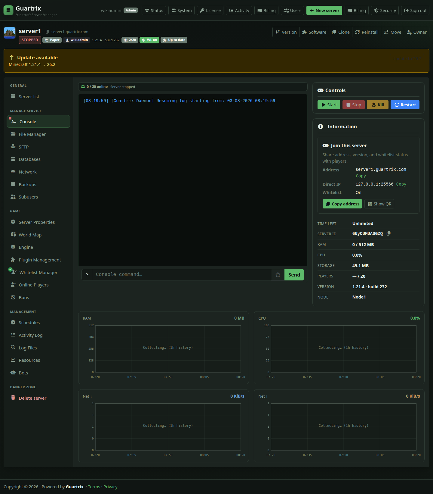
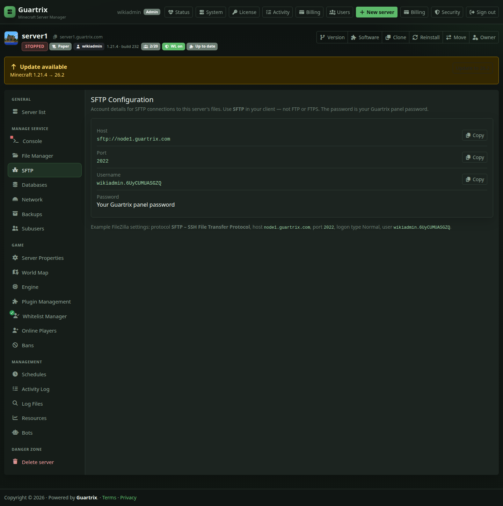
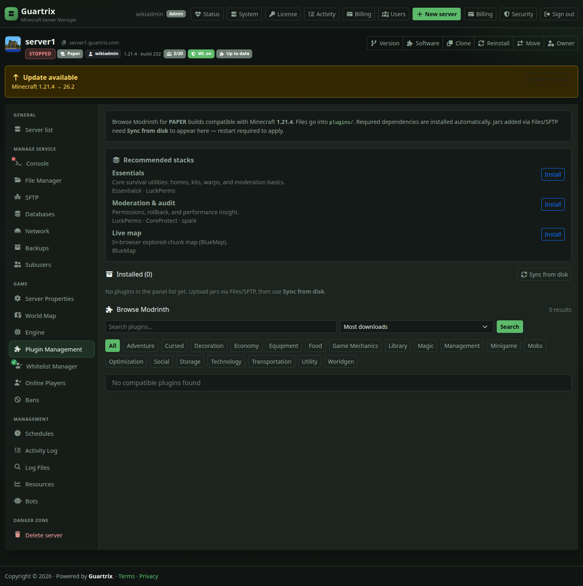
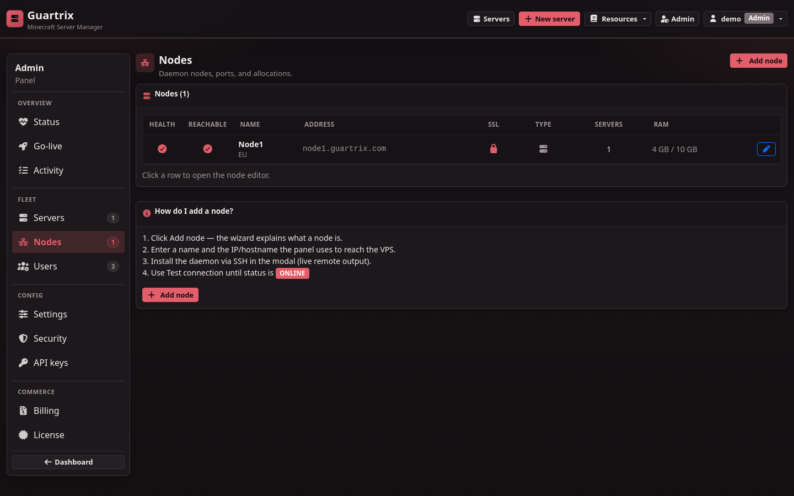

# Guartrix wiki

Operator and developer documentation for the Guartrix Minecraft hosting panel.

> **AI-generated project disclaimer**
>
> Guartrix was built as a Cursor AI experiment to test how far a **100% AI-generated** project could go. Because of that, the code and documentation may contain mistakes, bugs, incomplete behavior, or security issues. Do not assume production safety without doing your own review, testing, and hardening.

**Live panel:** [https://guartrix.com](https://guartrix.com)  
**Source:** [github.com/TomThermo/guartrix](https://github.com/TomThermo/guartrix)  
**Short overview:** [../../README.md](../../README.md)

## Start here

| Page | Description |
|------|-------------|
| **[Panel guide (screenshots)](panel-guide.md)** | Full UI tour — login, dashboard, console, SFTP, mods, admin, … |
| [Install the panel](install-panel.md) | Ubuntu install (download → run) + existing checkout |
| [Install nodes](install-nodes.md) | Add remote daemons (SSH wizard / curl) |

## Contents

| Page | Description |
|------|-------------|
| [Architecture](architecture.md) | Monorepo layout, request flow, panel ↔ daemon |
| [API and surface map](api-surface-map.md) | Full inventory of UI pages, route families, daemon routes, packages, scripts, and schema domains |
| [Environment variables](env-reference.md) | `.env` / `daemon.env` knobs |
| [Panel settings (Admin UI)](panel-settings.md) | Domain, SMTP, HTTPS, quotas, alerts via Admin → Settings |
| [Accounts & quotas](accounts-and-quotas.md) | Register, verify, reset, quotas, subusers |
| [Auth and session internals](auth-and-session-internals.md) | Sessions, TOTP, API keys, app passwords, daemon auth, invite/reset token surfaces |
| [Server management](server-management.md) | Create/import/clone/reinstall/transfer and the full server-detail surface |
| [Files and backups](files-and-backups.md) | File manager, SFTP, jail rules, backup and restore flows |
| [Networking and allocations](networking-and-allocations.md) | Ports, primary/extra allocations, Docker/firewall interaction, node connectivity |
| [Player management](player-management.md) | Online players, whitelist, bans, moderation, history |
| [Mods, plugins, and modpacks](mods-plugins-and-modpacks.md) | Addons, engine compatibility, modpacks, resource-pack-adjacent content flows |
| [SFTP](sftp.md) | Per-node SFTP, username format, permissions |
| [Notifications and alerts](notifications-and-alerts.md) | Email, webhook, push, in-panel warnings, critical event sinks |
| [Operations](operations.md) | Start/stop, watchdog, backups, logs, ports |
| [Activity log](activity-log.md) | Audit trail, filters, retention, Discord/email alerts |
| [Client API](client-api.md) | Personal API keys, Bearer auth, servers / power / files |
| [OpenAPI](../openapi.yaml) | Machine-readable Client + Application paths |
| [Application API & Mollie](application-api.md) | Admin machine keys, plan templates, Mollie checkout |
| [Billing internals](billing-internals.md) | Plan templates, payment lifecycle, quota application, subscriptions, machine API |
| [Licensing](licensing.md) | License key, Admin → License, remote validate API |
| [License flow internals](license-flow-internals.md) | Signed claims, daemon ticketing, grace/fallback behavior, repo boundary |
| [Release builds (sell / ship)](release-builds.md) | Minified bundles, tarball, password `/download` zips |
| [Build and release internals](build-and-release-internals.md) | `build/`, staging, sanitize rules, package scripts, release pipeline |
| [Prod-web and downloads](prod-web-and-downloads.md) | Edge server, reverse proxy, TLS, `/download` boundary |
| [Schedules](schedules.md) | Schedule chains: backup → wait → restart → command |
| [Move between nodes](node-transfer.md) | Admin transfer: stop → sync → rebind ports/DNS → start |
| [Security](security.md) | Hardening checklist and known controls |
| [Scaling](scaling.md) | Multi-node scale; when Redis is (not) needed |
| [Development](development.md) | Local `dev:*` workflow, Vitest, CI |
| [Daemon API](daemon-api.md) | Node-local control plane, route groups, auth, metrics, reattach model |
| [Node-agent internals](node-agent-internals.md) | Docker, files, quotas, SFTP, MySQL, firewall, player history |
| [Shared contracts](shared-contracts.md) | Shared types, permissions, activity taxonomy, daemon JWT, license verification |
| **[Improvement map](../roadmap.md)** · [Canvas](/home/ubuntu/.cursor/projects/home-ubuntu-Documents-Minecraft/canvases/improvement-map.canvas.tsx) | Shipped · Sprint 9 done on download host · P2 optional |

## Screenshot preview

| Login | Dashboard | Console |
|-------|-----------|---------|
|  |  |  |

| SFTP | Plugin Management | System |
|------|--------------------|--------|
|  |  |  |

All screenshots live under [`assets/`](assets/) and are embedded in the [Panel guide](panel-guide.md).

## Version

Docs track the **main** branch (V0.2+ soft-launch / multi-node). When behaviour or UI changes, update the relevant wiki page, screenshots (`scripts/capture-wiki-screenshots.mjs`), and the root README hub.
