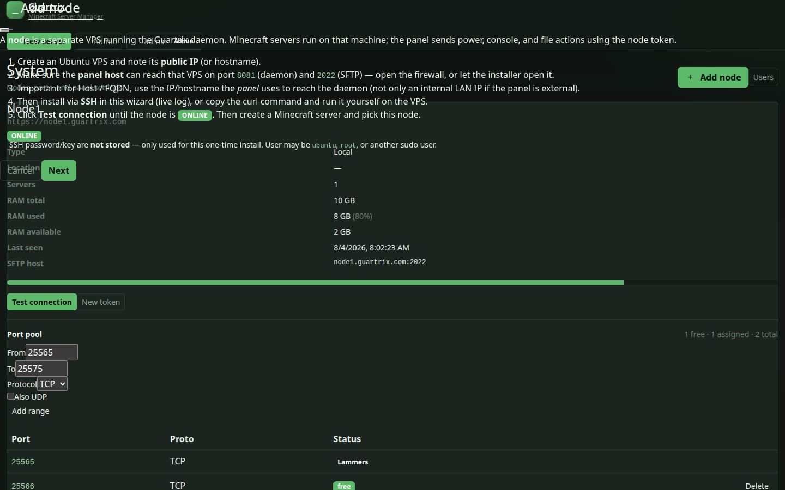

# Install nodes (remote daemons)

A **node** is a VPS running the Guartrix daemon. Minecraft servers are scheduled onto nodes. The panel reaches each node at `http(s)://HOST:8081` with a **short-lived JWT** signed using the per-node shared secret (`DAEMON_TOKEN`).

## Recommended: Admin UI wizard

1. Sign in as **admin** → **System**.
2. Click **Add node**.
3. Read the short howto, then enter:
   - **Name** (e.g. `node-2`)
   - **Host / FQDN** — IP or hostname the **panel** uses to reach this VPS
   - Optional **Location / region** label (shown in the create-server node picker)
   - Scheme (`http` on LAN/VPS is typical) and daemon port (`8081`)
4. On the install step, enter SSH user + password **or** private key (default SSH user often `ubuntu`; optional non-22 SSH port), plus your **Guartrix panel password** (step-up so a stolen admin session alone cannot remote-install).
5. First SSH attempt prints the **host-key fingerprint** and stops until you confirm **Trust this host key** (stored on the node). Later installs must match; after a VPS rebuild use **Replace host key**.
6. Watch the **live log** from the remote server. On success the wizard **auto-tests** the daemon.
7. If needed, click **Test connection** until status is **ONLINE**.
8. Create a Minecraft server and select that node (admins only choose node placement).

SSH credentials are used once and **not stored**. The host-key fingerprint **is** stored for MITM protection.

`install-daemon.sh` opens the daemon port preferably **only from the panel IP** (via ufw); SFTP and game ports stay world-reachable as needed.

Remote config lives at **`/var/lib/guartrix/daemon.env`** (not `$INSTALL_DIR/data/daemon.env`). Code under `/opt/guartrix`.




For an existing remote node, open the node (table row / edit). **Basic Settings** covers display name, domain, connect port, and SSL mode. **Configuration File** shows `daemon.env` to copy onto the node (`/var/lib/guartrix/daemon.env`), an auto-deploy command, and token reset — like Pelican/Pterodactyl’s config.yml flow. **Overview** has live host stats and **Install daemon** (SSH wizard).

See also the [Panel guide](panel-guide.md) for the rest of the admin UI.

## Manual install

On the remote Ubuntu VPS (as root or via sudo) — download, then run:

```bash
curl -Lo /tmp/guartrix-daemon.sh https://YOUR_PANEL/install-daemon.sh
sudo bash /tmp/guartrix-daemon.sh \
  --token NODE_TOKEN \
  --node-id NODE_ID \
  --fqdn NODE_PUBLIC_IP \
  --port 8081 \
  --sftp-port 2022 \
  --panel https://YOUR_PANEL \
  --repo https://github.com/TomThermo/guartrix.git
```

Download the script, then run it (do not pipe curl into bash). `NODE_TOKEN`, `NODE_ID`, and the exact command are shown in the panel install modal. The installer writes **`/var/lib/guartrix/daemon.env`**.

Open firewall ports on the node:

| Port | Purpose |
|------|---------|
| `8081/tcp` | Daemon API (panel → node) |
| `2022/tcp` | SFTP |
| game ports | Java: `25565:25600/tcp` (+ UDP if you use query/Geyser). Bedrock: `19132:19332/udp` (default game port **19132/udp**) |

The installer can auto-open ports when `MANAGE_FIREWALL=true`.

## Docker access (least privilege)

The daemon talks to Docker via `sudo -n docker` by default (passwordless sudo for the
install user). That is root-equivalent on the host if the daemon process is compromised.

Hardening options (pick one):

1. **Docker group** — add the daemon user to `docker`, drop the sudoers docker rule, and
   set `DOCKER_BIN=docker` (no sudo) in `/var/lib/guartrix/daemon.env` (remote) or
   `$INSTALL_DIR/data/daemon.env` (local). Understand that group membership
   is still effectively root via the Docker socket.
2. **Rootless Docker** — run Engine as the daemon user (best isolation; some
   networking / publish modes differ). Concrete outline:
   - Install rootless prerequisites (`uidmap`, `dbus-user-session`, etc.) per
     [Docker rootless docs](https://docs.docker.com/engine/security/rootless/).
   - As the **daemon OS user** (not root), run:
     `dockerd-rootless-setuptool.sh install`
     (starts a user-mode `dockerd` and systemd user unit).
   - Point clients at the user socket, e.g.
     `DOCKER_HOST=unix:///run/user/UID/docker.sock`
     (`UID` = that user’s numeric id; also exported by the rootless helper).
   - In the daemon env file set `DOCKER_BIN=docker` (no `sudo`) and ensure the
     daemon process inherits `DOCKER_HOST` (systemd `Environment=` / `EnvironmentFile=`
     — remote units load `/var/lib/guartrix/daemon.env`).
   - Confirm with `docker info` / daemon `/ready` as that user.
   - **SELinux:** volume mounts often need `:z` / `:Z` (or equivalent context
     relabel) so rootless containers can write host bind mounts; without it you
     get “permission denied” on world files. Check audit logs if mounts fail.
3. **Keep sudo** — tighten sudoers to only the exact `docker` binary + subcommands the
   node-agent uses (not a full shell).

Checklist still expects `/health` and `/ready` (Docker reachable) after changes.

## Docker networks

`DOCKER_NETWORK_MODE` controls how game containers are networked on a node
(daemon env file — remote: `/var/lib/guartrix/daemon.env`):

| Mode | When to use |
|------|-------------|
| **`per_server`** (default) | Multi-tenant nodes or **untrusted players** — each server gets an isolated `guartrix-s-<id>` bridge so containers cannot reach each other’s IPs on the game network. New remote installs write this automatically. |
| **`shared`** | Single-tenant hosts, trusted players, or when you want the simplest setup — every game container shares the flat `guartrix` bridge with MySQL (`guartrix-mysql` DNS works out of the box). |

Set `DOCKER_NETWORK_MODE=shared` in the daemon env file only when you want the flat bridge.
With `per_server`, the daemon **still attaches** each game container to the shared `guartrix`
bridge as a second network so game MySQL DNS (`guartrix-mysql`) keeps working — only peer
game traffic is segmented on the per-server bridge.

Restart the daemon (and recreate running game containers) after changing the mode.

Shared plugin/world dirs for **extra host mounts** should live under `/var/lib/guartrix/shared` or `/opt/guartrix/shared` on the node (or set panel `EXTRA_MOUNTS_ALLOW_PREFIX`). Changing mounts is **admin-only**.

## Checklist

- [ ] Panel can HTTP reach `HOST:8081/health` and `/ready`
- [ ] Node shows **ONLINE** after Test connection
- [ ] SFTP host resolves (optional Cloudflare DNS for `sftpHostname`)
- [ ] New servers land on the intended node

## Scaling note

Many nodes + one panel is the supported model. See [Scaling](scaling.md).

## Install script supply chain (residual risk)

The panel **Add node** wizard and [`scripts/install-daemon.sh`](../../scripts/install-daemon.sh)
may install Docker and Node.js via upstream convenience scripts when they are missing:

- Docker: `curl -fsSL https://get.docker.com | sh` — see [Docker Engine install docs](https://docs.docker.com/engine/install/)
- Node.js 22: `curl -fsSL https://deb.nodesource.com/setup_22.x | bash -` — see [NodeSource distributions](https://github.com/nodesource/distributions)

These are common for greenfield VPS installs but carry **residual supply-chain risk**
(pipe-to-shell without pinning). For production hardening:

### Preseed checklist (skip curl|sh)

Run on the **node** before Guartrix install:

```bash
# 1) Docker Engine from vendor packages (example: Ubuntu apt — pin versions in real deploys)
sudo apt-get update
sudo apt-get install -y docker-ce docker-ce-cli containerd.io
sudo systemctl enable --now docker
docker --version

# 2) Node.js 22.x from a pinned repo / package (verify version)
node -v   # must be v22.x
```

Then run `install-daemon.sh` / Add-node. When `docker` and `node` are already on `PATH`
with Node ≥ 22, the installer **prints a tip and skips** the convenience scripts
(offline / air-gapped friendly).

### Additional mitigations

1. Prefer cloning or unpacking a **tagged Guartrix release** (`--repo` + `--branch`) rather
   than pulling arbitrary `main` on sensitive hosts.
2. Keep the daemon firewall rule **panel-IP only** (`PANEL_URL` + ufw) so a compromised
   install script still cannot expose the daemon to the world.
3. If you must use convenience scripts once, pin versions and verify **checksums / signatures**
   per vendor docs — do not blindly re-run `curl | sh` on every deploy.

See also [Security — install supply chain](security.md#install-script-supply-chain-residual-risk).
