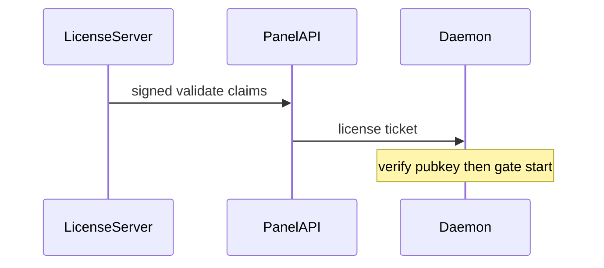

# Licensing

Customer panels validate a **license key** against Guartrix’s public license API.

Default:

`LICENSE_SERVER_URL=https://license.guartrix.com`

Set the key in `.env` as `LICENSE_KEY`, or under **Admin → License**. You can also change the license API URL there if Guartrix gives you a different endpoint.

**Remove license** (Admin → License) deletes the key and drops the panel to the free tier immediately (a `LICENSE_KEY` left in `.env` stays ignored until a new key is saved). The removal is recorded in the activity log.

## Free tier (no valid license)

Without a valid license (missing key, expired, revoked, or grace expired), the panel stays online and runs a **free tier**:

| Cap | Limit |
|-----|-------|
| Nodes | **1** |
| Minecraft servers | **1** |
| Disk per server | **10 GB** |

- Creating a second node or server is blocked.
- Disk above 10 GB (or unlimited `0`) is blocked on create/update.
- Start/restart works for the single free-tier server if it is within the disk cap.
- Extra or over-disk servers that are running are stopped on validate / expiry.

Activate a license under **Admin → License** to raise these caps (and unlock license feature quotas).

## What the panel does

| Piece | Role |
|-------|------|
| **Panel API** | Calls `POST /v1/validate` on a schedule; verifies **Ed25519-signed** responses; pushes a **license ticket** to every daemon |
| **Daemon** | Verifies the same public key; refuses start/restart above free-tier (or license caps) without a valid ticket |
| **Admin → License** | Status, license key, optional server URL override, revalidate, allowance vs in use |
| **Game servers** | Licensed product caps (nodes / servers / RAM); free-tier caps when invalid |

The **website/panel UI stays online** when a license expires. Admins see a banner (free-tier wording) and use **Admin → License**. End users are not shown a page banner; start/restart over free-tier limits shows a console error.

## Env (panel + daemon)

| Variable | Purpose |
|----------|---------|
| `LICENSE_SERVER_URL` | License API base URL (default `https://license.guartrix.com`) |
| `LICENSE_KEY` | Your `GTRX-…` key |
| `LICENSE_INSTALL_ID` | Optional stable install id (else auto-file under `data/`) |
| `LICENSE_VERIFY_PUBLIC_KEY` | Optional PEM; else `data/licenses/signing-public.pem` **shipped in every customer panel zip** (daemon uses the same file) |
| `LICENSE_UNREACHABLE_GRACE_MS` | Soft-valid window if the API is unreachable (default **12h** / `43200000`) |
| `LICENSE_VALIDATE_INTERVAL_MS` | How often to re-check (default 10 minutes) |
| `LICENSE_VALIDATE_FAIL_ALERTS` | Activity alert after N consecutive validate failures (default `3`) |

See [Environment variables](env-reference.md).

## Security note

This is a **commercial control plane**, not DRM. Prefer [release builds](release-builds.md) (no sources in the customer tarball). A determined attacker who patches **both** the panel API and the daemon can still skip checks.

Hardening in place:

- Daemon co-enforcement (ticket + public-key verify) so bypassing only the API is not enough to start extra game servers
- Shorter default unreachable grace (12h)
- Activity alert on repeated validate failures

The **license issuer** (signing keys, admin UI that mints `GTRX-…` keys) is **not** part of this repository. It runs only on Guartrix operator infrastructure. Never commit `apps/license-server`, `signing-private.pem`, or issuer databases into this repo.

The panel GitHub repo stays **public** (source available). License control relies on signed tickets + daemon co-enforcement and the private issuer — not on hiding panel source.

## Related

- [Install the panel](install-panel.md)
- [Operations](operations.md)
- [Release builds](release-builds.md)
