# Panel guide (UI tour)

Visual walkthrough of everything you can do in the Guartrix web panel. Screenshots are from a live admin session.

**Live panel:** [https://guartrix.com](https://guartrix.com)

---

## Sign in & accounts

### Login

Open the panel URL → sign in with your username and password. Admins open **Admin** in the top bar for **Status**, **System**, **License**, **Activity**, **Panel billing**, and **Users**. Your account menu (username) has **Billing**, **Security**, and **Sign out**.

### Register

Self-serve registration (when enabled). New accounts start with **0** servers / RAM / databases until an admin raises quotas or the user pays via **Billing** (Mollie).

Navbar → **Billing** — pick a plan and pay with Mollie (when `MOLLIE_API_KEY` is set). Admins manage plans and Application API keys under **Admin → Billing**.

More: [Application API & Mollie](application-api.md) · [Accounts & quotas](accounts-and-quotas.md)

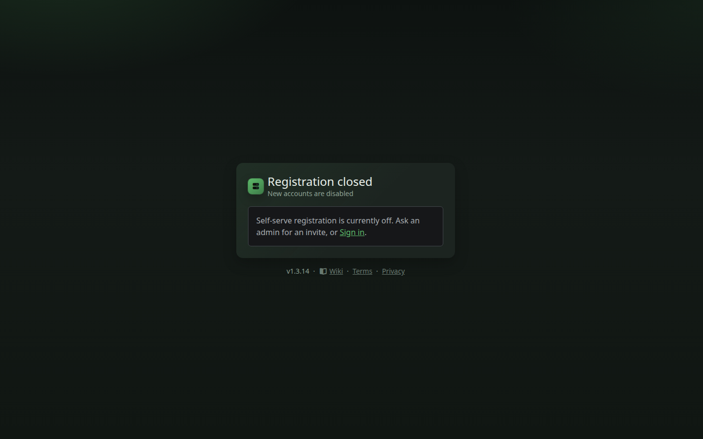

### Forgot password

Request a reset link by email. Without SMTP, messages land in `data/mail-outbox/`.

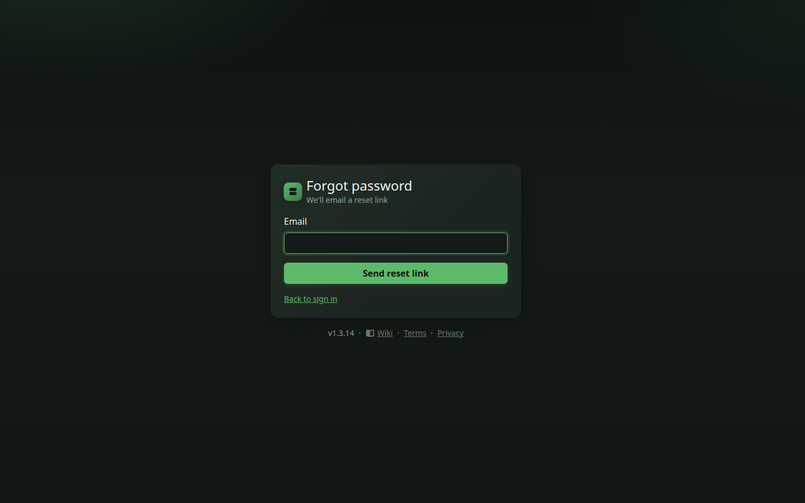

### Two-factor (Security)

Navbar → **Security** — enable TOTP by scanning the QR code (or typing the secret) into an authenticator app, then save the one-time recovery codes. When 2FA is on, sign-in asks for a code after the password. Admins can reset a user's 2FA from **Users**. The same page has an **Appearance** control for dark / light / system theme (stored in this browser as `guartrix.theme`).

Same page: **API keys** for scripts (`Authorization: Bearer gt_…`). Create with a permission preset or custom scopes, copy the token once, revoke anytime. **SFTP app passwords** (`gtap_…`) let FileZilla/WinSCP authenticate without the panel password.

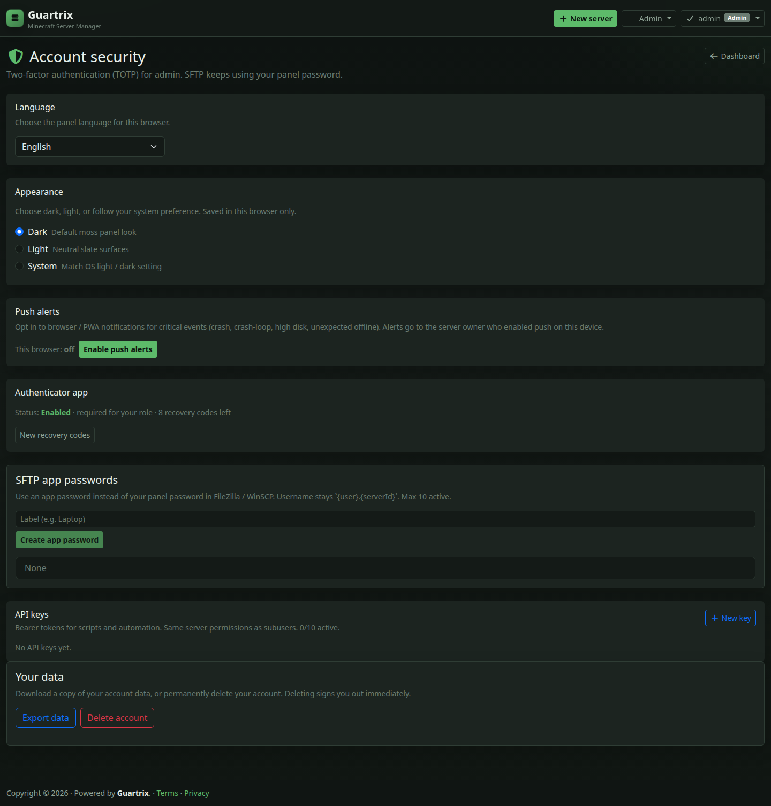

More: [Accounts & quotas](accounts-and-quotas.md) · [Client API](client-api.md) · [Application API & Mollie](application-api.md) · [SFTP](sftp.md)

Navbar → **Billing** — pick a plan and pay with Mollie (when configured).

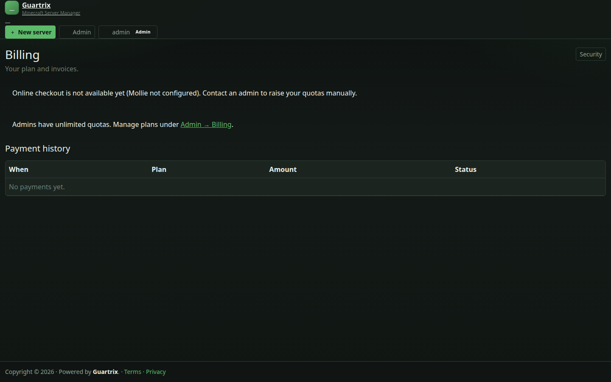

Admins manage plans (including auto-create / recurring) and Application API keys under **Admin → Billing**.

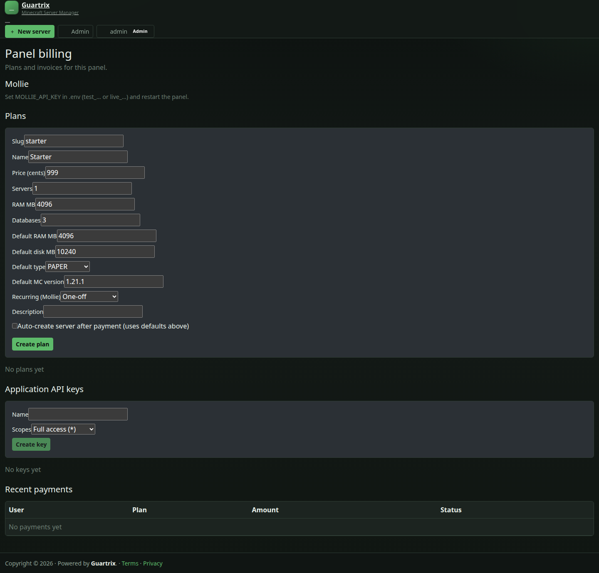

---

## Dashboard (server list)

Home page lists every Minecraft server you can access: status, engine, RAM/CPU meters, and quick Start / Stop / Restart / Manage. A search box plus **status / node / type** filters narrow the list on larger installs.

Each row shows clickable chips for **disk used / limit**, **online players** (`0/20`), **Whitelist on/off** (opens a toggle modal), and **plugin/mod updates** (opens Plugin Management). Chips deep-link into the matching server tab via `?tab=`.

---

## Create a server

**+ New server** — pick software (Vanilla, Paper, Purpur, Fabric, Quilt, Forge, NeoForge), version, RAM, port, and (admins) which node. Optional **world preset** (Default / Flat / Void) and **seed** are applied on first start.

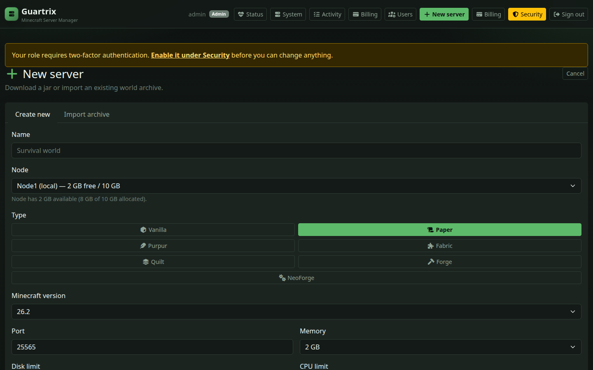

The same page has an **Import archive** tab to create a server from an existing world/server `.zip` or `.tar.gz`. **Clone** lives on the server detail page (top actions).

---

## Admin: Users

**Users** — create accounts, change roles (`ADMIN` / `OPERATOR` / `VIEWER`), and raise **max servers / memory / databases** when a plan is sold.

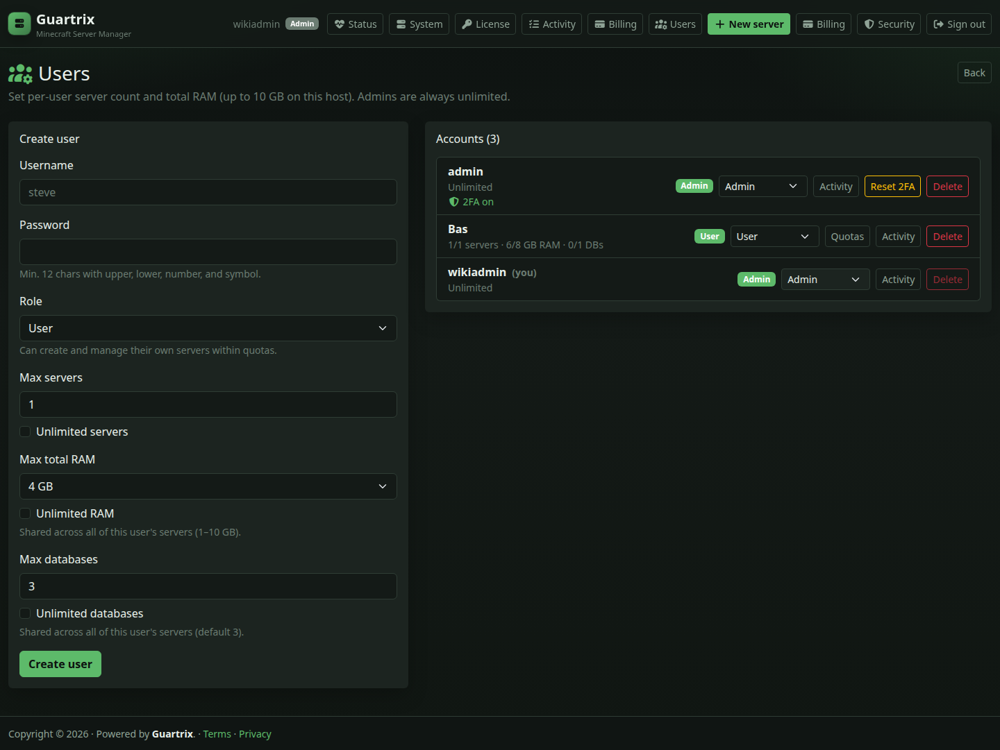

---

## Admin: System (nodes)

**System** — local + remote daemon nodes, online status, optional **location/region**, memory, SFTP hostname,
rename, **edit daemon URL** (pencil next to `http://…:8081`), Test connection, Install daemon.

### Add node wizard

**Add node** → howto → details → SSH install with **live log** → done. Credentials are used once and not stored.

More: [Install nodes](install-nodes.md)

---

## Admin: License

**License** (`/admin/license`) — panel license status, expiry, masked key,
**allowance vs in use** (nodes / servers / total RAM / largest server vs license caps),
enabled **features** (green = on, red = not included), revalidate, change key,
**remove license** (drops to the free tier), and
**license server URL** (typically `https://license.guartrix.com`). Quotas and
features are set on your license by Guartrix; they apply after revalidate (or the
next ~10 minute background check). Tabs and dashboard chips without a license
feature stay hidden.

When the license is missing, expired, or revoked, the install runs a **free tier**:
**1 node**, **1 Minecraft server**, **10 GB disk**. Extra or over-disk servers are
stopped; start/restart works only within those caps. The panel website stays up.
Admins see a red banner with a link to this page. Regular users get a **red console
message** when start/restart is blocked (no page banner).

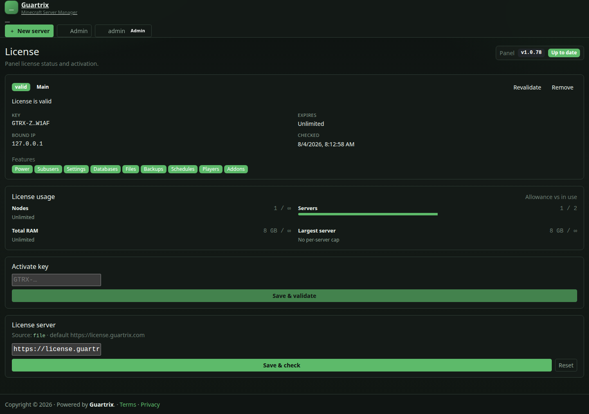

More: [Licensing](licensing.md)

---

## Admin: Activity

**Activity** (`/admin/activity`) — one stream across every server and user:
logins, power actions, admin and node changes. Same filters as the per-server
tab, plus a Server column.

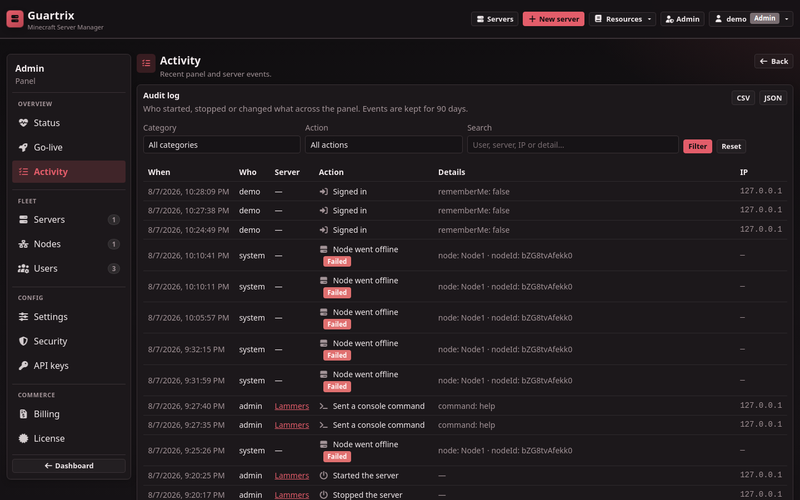

More: [Activity log](activity-log.md)

---

## Statusline

**Status** — health of web, API, watchdog, and every node (CPU/RAM overview).

---

## Server detail

Open a server from the dashboard. Sidebar groups:

| Group | Tabs |
|-------|------|
| Manage service | Console, File Manager, **SFTP**, Databases, **Network**, Backups, Subusers |
| Game | Server Properties, **World Map**, **Engine** (Paper/Purpur), **Plugin Management**, **Modpacks** (Fabric/Forge…), Whitelist, Online Players, Bans |
| Management | Schedules, **Activity Log**, Log Files, Resources |

The header meta row shows status, loader, owner, version, **online players** (`3/30` — opens Online Players), **Whitelist on/off** (opens a quick toggle modal), and **plugin/mod updates** (opens Plugin Management). Top actions include **Clone**, **Reinstall**, **Move** (admin — to another node), **Owner** (admin), and Start / Stop / Kill / Restart.

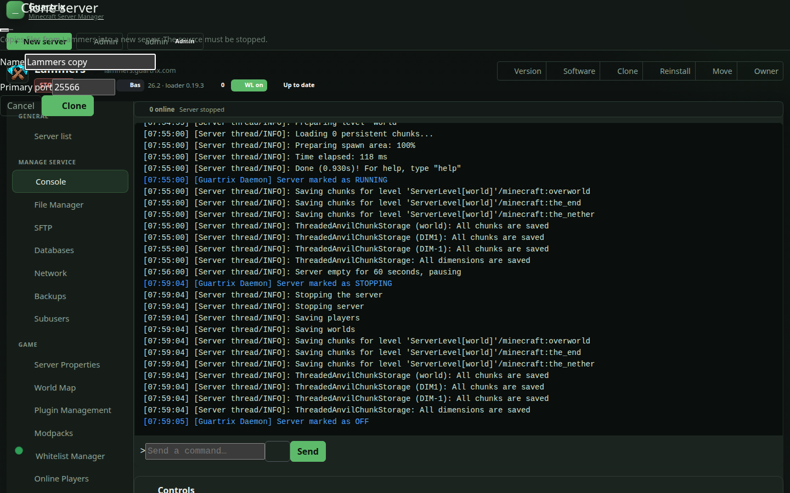

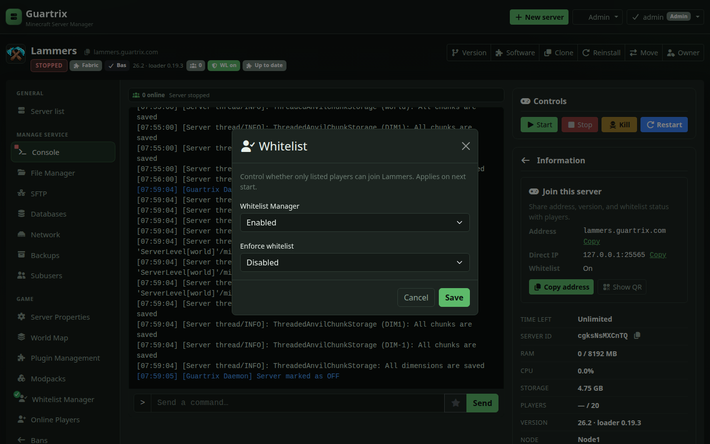

**Version & software** live in the header toolbar (**Version** / **Software** on desktop; on small screens open **Manage**). Pick any listed Minecraft version (upgrade or downgrade with confirm), or change software (Paper ↔ Fabric, etc., with addon wipe when crossing plugin/mod ecosystems). When a newer build is available, a yellow **Update available** banner still appears above the console. **Reinstall** refreshes the runtime with optional keep-world / keep-addons; a backup is always created first.

More on moving servers: [Move between nodes](node-transfer.md)

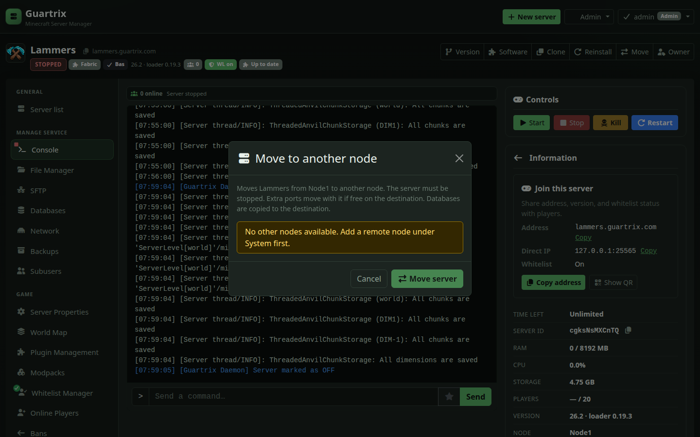

### Console (live)

WebSocket console: live logs, send commands, power controls, address / RAM / CPU / storage / players. Below the console, **history charts** show roughly the last hour of CPU / RAM / network from the API ring buffer (persisted under `data/stats-history/` so samples survive panel restarts).

### File Manager

Browse, upload (up to **2 GiB**, streamed), edit, delete, **download**, and
**zip / unzip** files inside the server data directory. Select multiple entries
to zip in place or download as a zip. Needs `file.download` / `file.archive`
for those actions. A disk usage card above the browser shows **used / quota · free**
and the same World / mods·plugins / backups / other breakdown as Resources.

### SFTP (FileZilla / WinSCP)

Copy-ready host, port **2022**, username `{panelUser}.{serverId}`. Password =
panel password **or** an app password (`gtap_…`) from Account → Security. Use
**SFTP**, not FTP/FTPS.

More: [SFTP](sftp.md)

### Databases

Per-server MySQL on the node (`guartrix-mysql`). Create DBs within the user’s database quota.

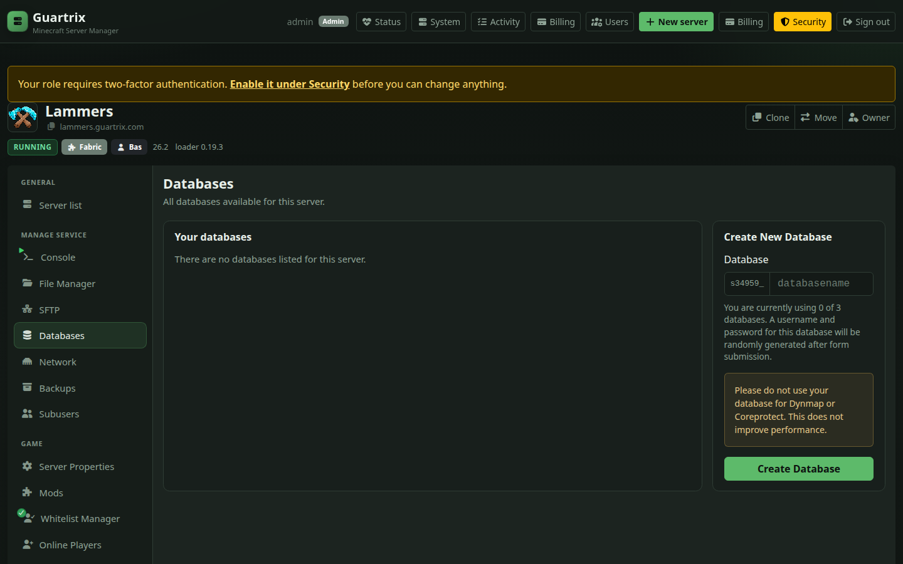

### Network / Allocations

Primary game port plus optional extra TCP/UDP ports (plugins, query, voice, …). Firewall opens on assign; Docker publishes extras on the **next start/restart**. Promote a secondary TCP allocation to primary only while the server is stopped. Optional **also UDP** companion on the same port for query/Geyser. Paper/Purpur: **Install Geyser** one-click (Geyser + Floodgate via Modrinth + UDP companion).

Permissions: `allocation.read` / `create` / `update` / `delete`.

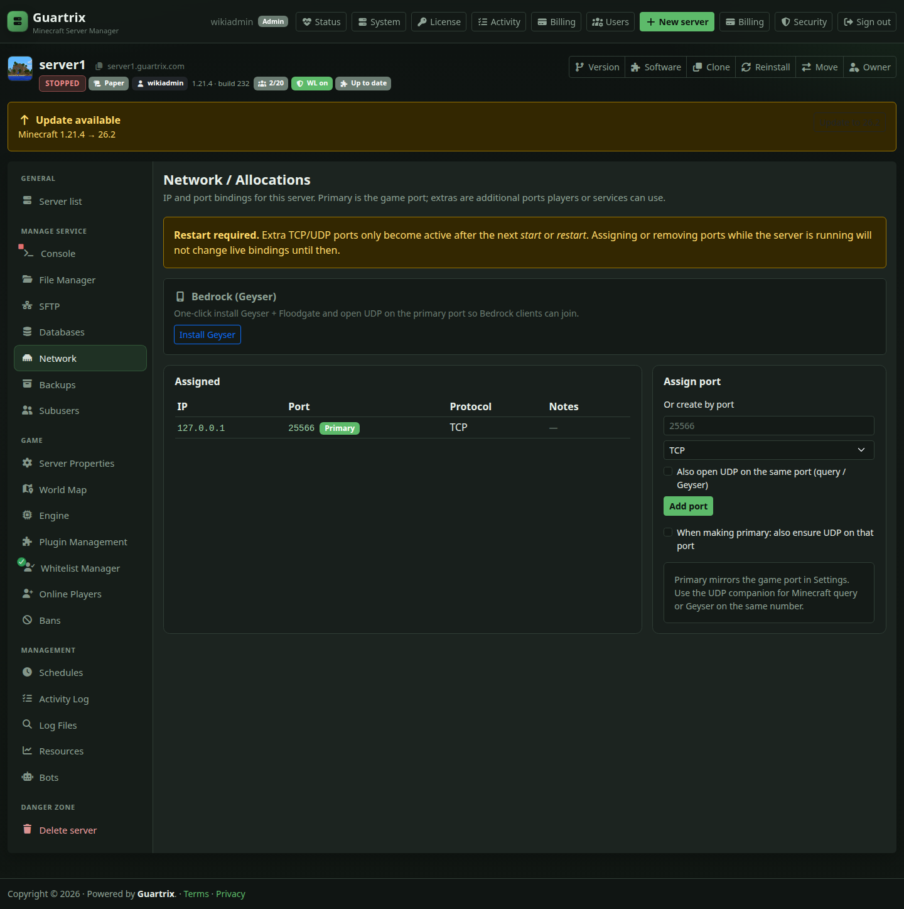

### Backups

Create archives, download/upload, restore. Pair with **Schedules** for automation.

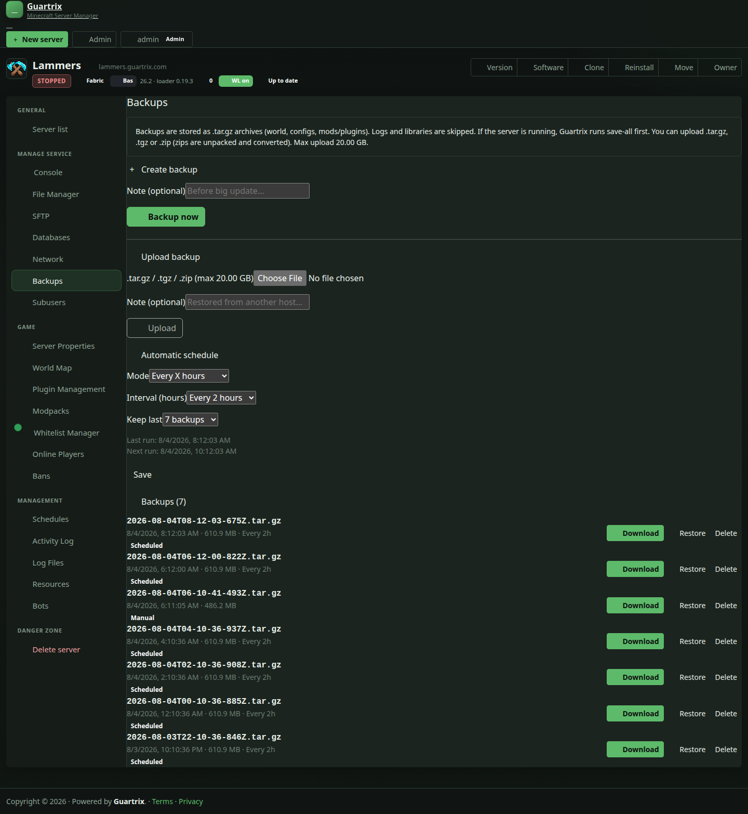

### Subusers

Invite by email with fine-grained permissions (console, files, SFTP, backups, …).

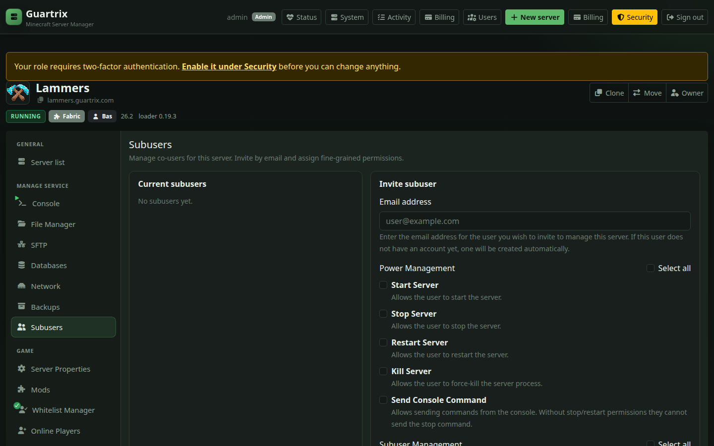

### Server Properties

Edit `server.properties`, startup / Java settings (permission-scoped), and **extra host mounts** under Start Configuration (`settings.update`) — bind allowlisted host dirs into the container (apply on next restart). The **World** category includes **world tools**: reset selected dimensions and upload a `.zip` world (server must be stopped; backup first).

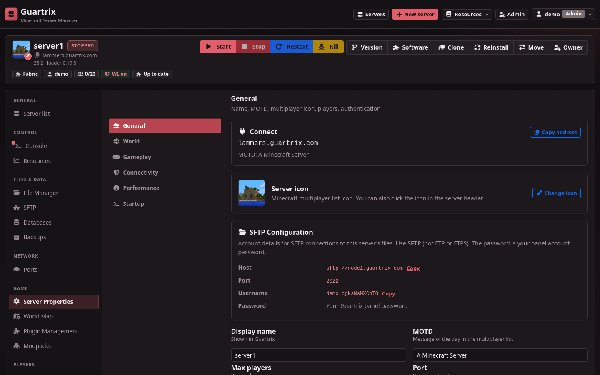

### World Map

Sidebar → **World Map** (`?tab=seedmap`). Shows the seed from `level-seed` or, when the server is running, from the live `/seed` console command. The seed map is embedded from [mcseedmap.net](https://mcseedmap.net/) (biomes and structures). **Open Chunkbase** is available as an alternate new-tab viewer. On Paper/Purpur you can **Install BlueMap** for a live explored-chunk map (expose port `8100`, save the URL). Needs `settings.read` or `control.console`; querying `/seed` needs `control.console`.

### Join card & player tools

Console sidebar **Join this server** shows address, direct IP, version, whitelist, player count, copy buttons, and a QR code. Online Players actions include kick/ban/OP with optional reason plus a **History** tab of moderation events for that player.

### Owner alerts & Discord status

Server Properties → **General**: optional owner Discord webhook / email for crash, OOM, disk-high, offline, and backup-failed. **Discord status** keeps one channel message updated (webhook, no bot token) with online/offline and player count.

**Account → Security → Push alerts**: opt-in browser / PWA notifications for the same critical events (requires operator `VAPID_*` keys). Alerts go to the **server owner** who enabled push on that device.

### Behind a proxy

Server Properties → **Access**: Velocity or BungeeCord one-click helpers (sets `online-mode=false` + forwarding flags / secret). Restart required. Paper/Purpur only.

### Subuser invite links

Subusers → invite by email generates a copyable `/invite/:token` link (7 days). Recipients sign in with that email and accept. **Invite link** regenerates/resends.

### Console favorites & plugin stacks

Console: star a command to save favorites (chips above the input; right-click to remove). Plugin Management: **Recommended stacks** (Essentials, moderation, BlueMap) install curated Modrinth sets on Paper/Purpur.

### Engine (Paper / Purpur)

Guided toggles for common `paper-global.yml` / `spigot.yml` / `purpur.yml` keys. Restart after saving. Fabric/Forge: use File Manager `config/`.

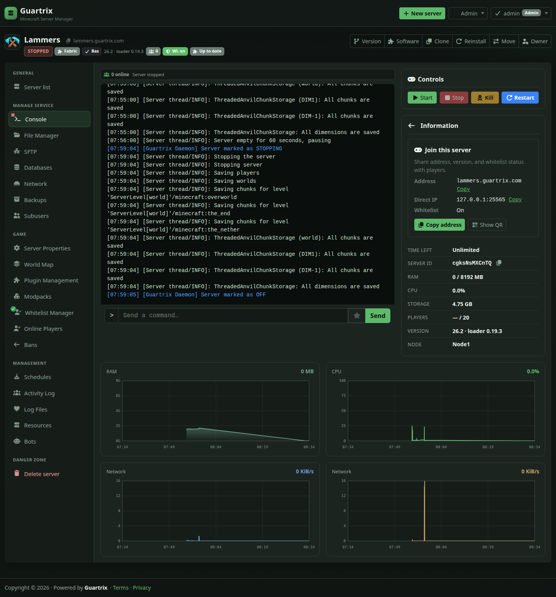

### Modpacks

On Fabric/Quilt/Forge/NeoForge: browse **Modrinth** (and **CurseForge** when `CURSEFORGE_API_KEY` is set), install a pack into the server (pre-backup). Restart required.

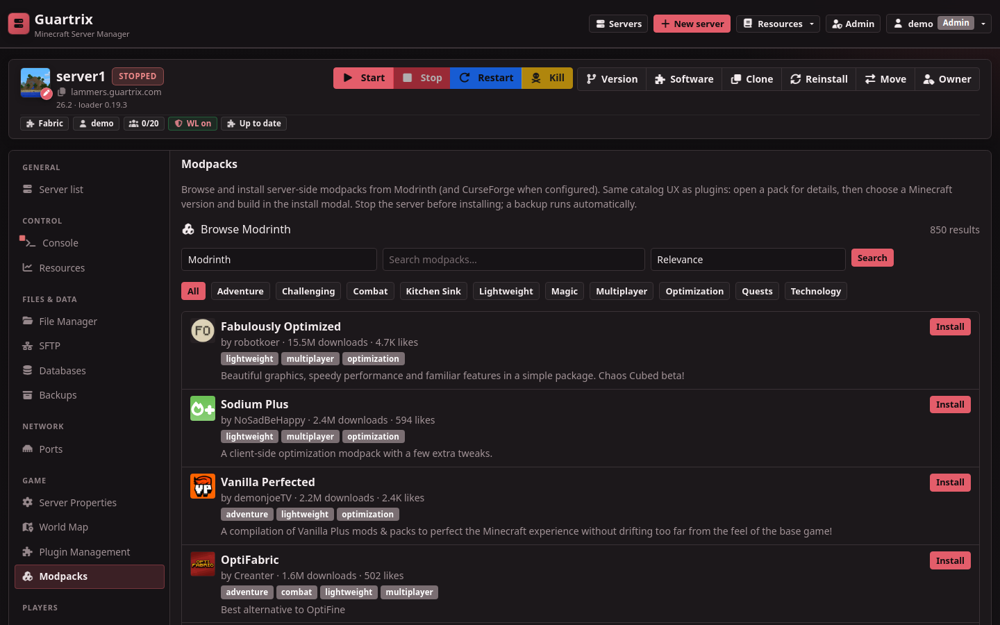

### Plugin Management (Modrinth)

The tab is labelled **Plugin Management** for both mods (Fabric/Quilt/Forge/NeoForge → `mods/`) and plugins (Paper/Purpur → `plugins/`). Browse Modrinth, install compatible builds, remove installed addons. Restart required after changes. Browse requests time out after about 12 seconds if Modrinth is slow or unreachable; changing sort/category cancels the previous search so the spinner does not stick.

The installed list is stored in `guartrix-addons.json`. Jars copied via **Files** / **SFTP** do not appear until you click **Sync from disk**, which scans `mods/` or `plugins/`, matches SHA-512 hashes on Modrinth, and lists unmatched jars as **local**.

The panel also checks Modrinth for newer builds compatible with the server’s loader + Minecraft version (deferred slightly so browse is not starved), shows an **update** badge, and offers **Update** / **Update all**.

**Install** / **Change version** opens a version picker. Pick a **Minecraft version** in the dropdown (server version first), then a build; the newest for that MC version is marked **Latest**.

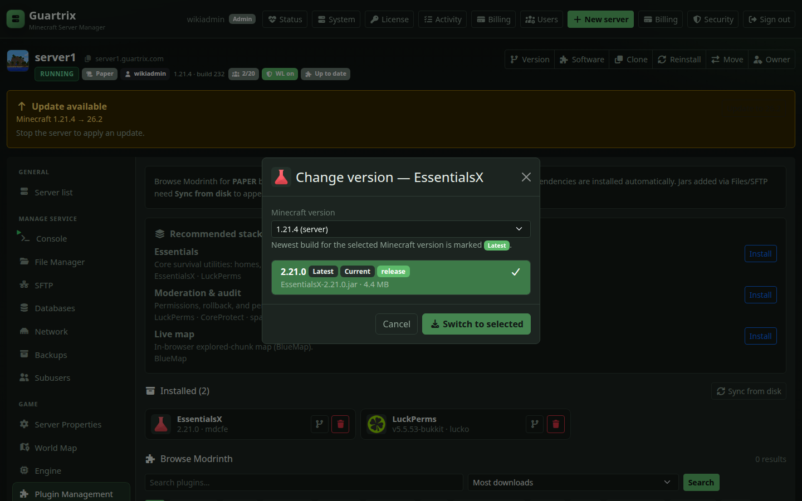

### Whitelist Manager

Toggle whitelist and manage allowed players.

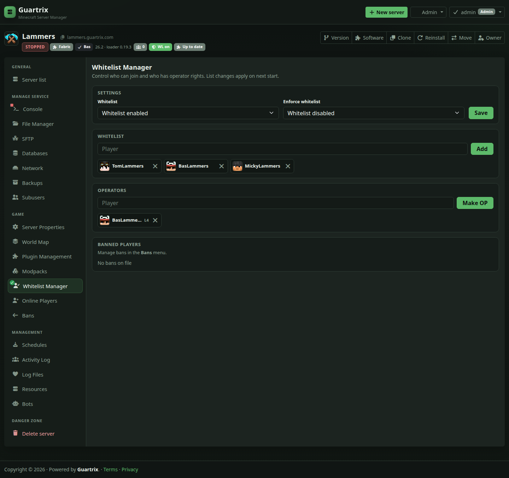

### Online Players

Who is online; kick / op / other player actions (permission-scoped).

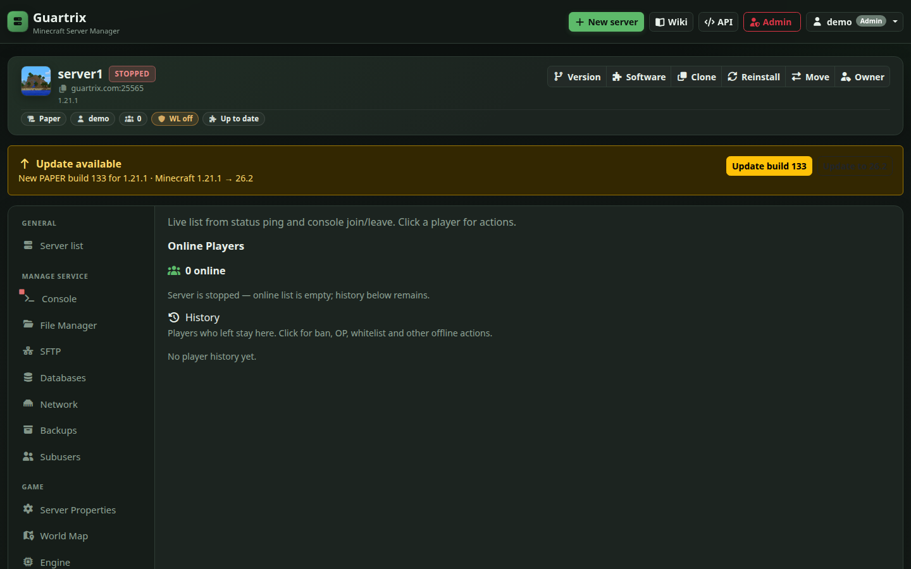

### Bans

View and manage ban list.

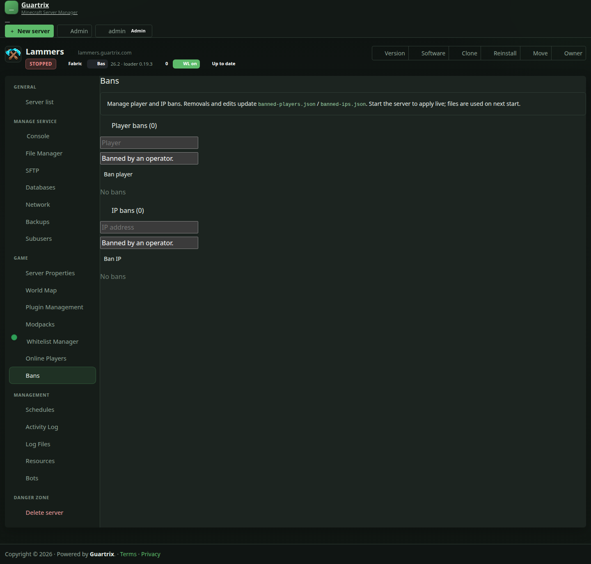

### Schedules

Timed **chains**: backup → wait → restart → command (delays / continue-on-failure).
**Run now** for a one-off. Simple backup-only cadence remains on the Backups tab.

More: [Schedules](schedules.md)

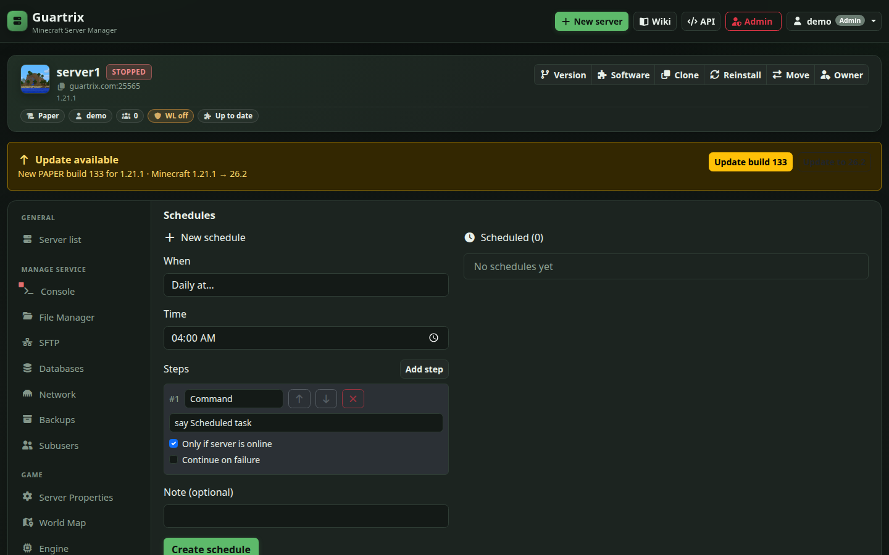

### Activity Log

Who did what on this server — power actions, settings, files, backups, ports,
subusers, players — with category / action / text filters and paging. Needs
`activity.read` (existing `audit.read` subusers keep access).

More: [Activity log](activity-log.md)

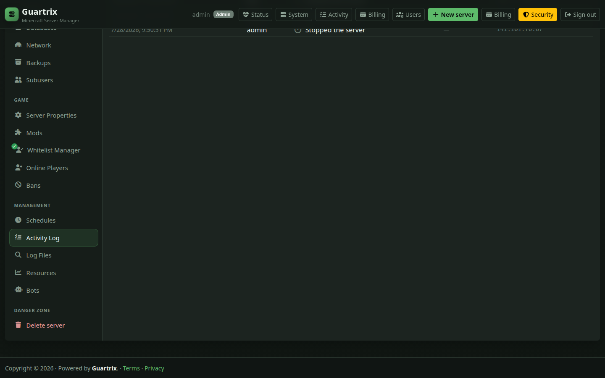

### Log Files

Download or read the Minecraft `logs/*.log` files the server itself wrote.

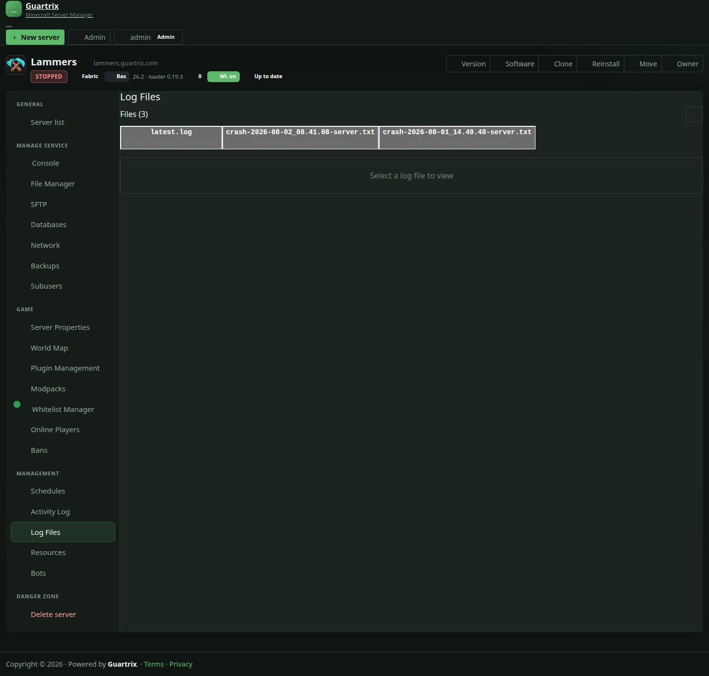

### Resources

Live meters plus the disk usage breakdown for the instance (World / mods·plugins / backups / other). The ~1-hour CPU / RAM / network **history charts** live on the **Console** tab.

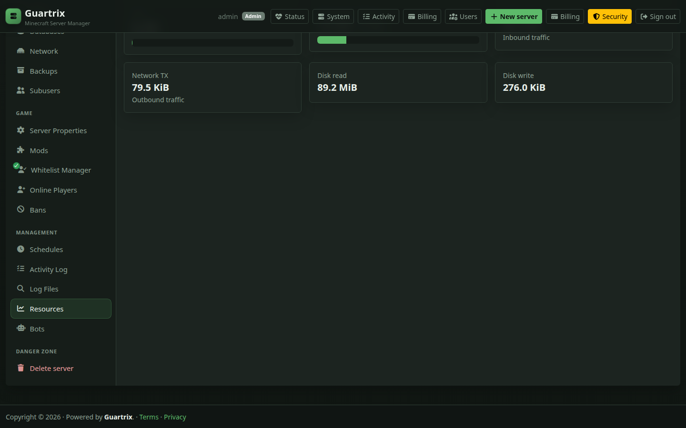

### Bots (admin)

Admin-only tab to attach / control in-game bots for this server. Bots run in a
forked API worker process (not inside Fastify); require `online-mode=false`.

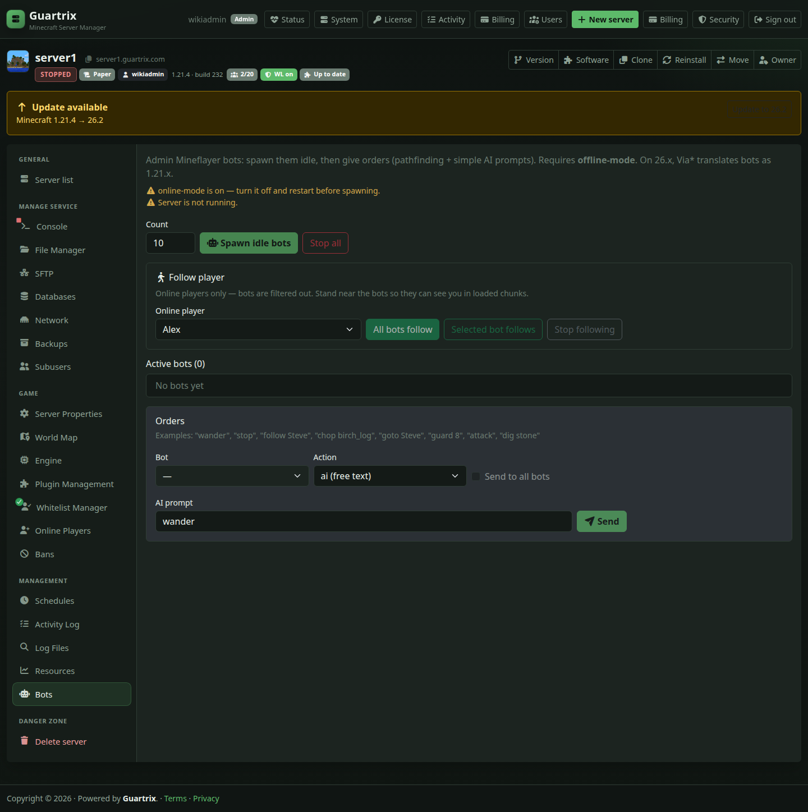

---

## Install as app (PWA)

The panel is a Progressive Web App: production builds register a service worker
(`/sw.js`) that caches the app shell, so browsers offer **Install app** / Add to
Home Screen and the UI loads instantly on revisit. There are **no push
notifications** — alerts go via Discord/email webhooks and optional Web Push
(see [Activity log](activity-log.md) and Account → Security). A hard refresh
picks up the latest shell when the PWA is installed.
new panel versions.

---

## What each role can do (summary)

| Capability | Admin | Owner | Subuser |
|------------|-------|-------|---------|
| All servers / nodes / users | ✓ | — | — |
| Create servers (within quota) | ✓ | ✓ | — |
| Console / power | ✓ | ✓ | if granted |
| Files + SFTP | ✓ | ✓ | if granted |
| Plugin Management | ✓ | ✓ | if granted |
| Backups / DB / schedules | ✓ | ✓ | if granted |
| Invite subusers | ✓ | ✓ | if `user.*` |

---

## Related

- [Install the panel](install-panel.md)
- [Accounts & quotas](accounts-and-quotas.md)
- [SFTP](sftp.md)
- [Operations](operations.md)
