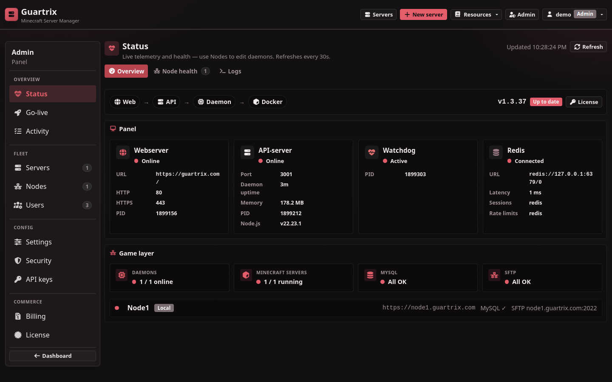

# Status overview (Admin → Status)

Admins open **Admin → Status** (`/admin/status`) for a live health board of the panel stack and every game node.

## What you see

| Area | Contents |
|------|----------|
| **Overview** tab | Compact architecture strip, version badge, panel tiles (Web / API / Watchdog / Redis), game-layer chips + node mini-list |
| **Nodes** tab | Per-node detail: IPs, host metrics, MySQL/SFTP, container table |
| **Logs** tab | Live tails (daemon, API, web, watchdog, MySQL, Minecraft consoles) |

The page auto-refreshes on an interval (`STATUS_REFRESH_MS` in the web app).

## When to use it

- After install: confirm web, API, and local/remote daemons are healthy
- After Redis / MySQL / HTTPS changes: confirm cards match the new topology
- Before blaming a game server: check whether the **node** is offline first

Day-to-day restarts: [Operations](operations.md). Node reachability: [Install nodes](install-nodes.md) · [Daemon API](daemon-api.md).

## Related

- [Panel guide](panel-guide.md#status)
- [Operations](operations.md)
- [Scaling](scaling.md) — Redis HA
